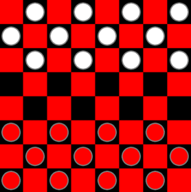

# Checkers

This is a simple Checkers game implemented in C++ using the SFML library. Currently, the game displays an 8x8 board with alternating white and red pieces in their starting positions.


## Features
- **Board Display**:  - An 8x8 checkered board, similar to a standard Checkers game
- **Piece Representation**: - White and red pieces are displayed on their starting positions

## Demo

Here’s a image of the game:




## Building the Project
**Note**: These instructions are specifically for Windows. For other platforms, adjust the paths and compilation steps accordingly.

### Requirements

- C++17 or higher
- SFML 2.6.1 or higher (prebuilt binaries)

### Setting up SFML
1. **Clone the project**:
   - Clone the repository from GitHub:
   ```bash
   git clone https://github.com/varun0138/Checkers
   cd Checkers
   ```

2. **Download SFML**: 
   - Download prebuilt binaries for SFML from the official [SFML website](https://www.sfml-dev.org/index.php).
   
3. **Configure your project**:
   - Extract the SFML binaries and place them in a folder (e.g., SFML-2.6.1).
   
4. **Add SFML to your environment**:
   - Update the `Makefile` included in the project with SFML libs and include paths.
   
   Example `Makefile`:
   ```makefile
   all: compile link run clean

   SFML_INCLUDE = C:/SFML-2.6.1/include
   SFML_LIB = C:/SFML-2.6.1/lib

   compile:
      g++ -c *.cpp -std=c++17 -g -Wall -m64 -I ${SFML_INCLUDE} -DSFML_STATIC

   link:
      g++ *.o -o main -L ${SFML_LIB}  -lsfml-graphics-s -lsfml-window-s -lsfml-system-s -lopengl32 -lfreetype -lwinmm -lgdi32 

   clean:
      del *.o *.exe
      
   run:
      ./main
5. **Compile the project**:
   ```
   make
## Troubleshooting

- **Missing dependencies**: Ensure the SFML library is correctly linked. If there are issues, verify the paths for the SFML `lib` and `include` folders are accurate.
- **Compiler errors**: Make sure you're using **C++17** or later, as the project may rely on language features introduced in these versions.